# Architecture

This document describes the system architecture of the DNS Record Management API, with a focus on the design decisions that make DNS itself the single source of truth.

## Table of Contents

- [Overview](#overview)
- [Core Design Principle: DNS as the Source of Truth](#core-design-principle-dns-as-the-source-of-truth)
- [Why Not a Database?](#why-not-a-database)
- [System Components](#system-components)
- [Data Flow](#data-flow)
- [Consistency Model](#consistency-model)
- [Deployment Topology](#deployment-topology)
- [Security Model](#security-model)

## Overview

This system provides a RESTful API and web interface for managing DNS records. It communicates directly with a DNS server (typically BIND) using standard DNS protocols:

- **AXFR** (RFC 5936) — Full zone transfers for reading zone data
- **DDNS** (RFC 2136) — Dynamic DNS updates for modifications
- **TSIG** (RFC 2845) — Transaction signatures for authentication

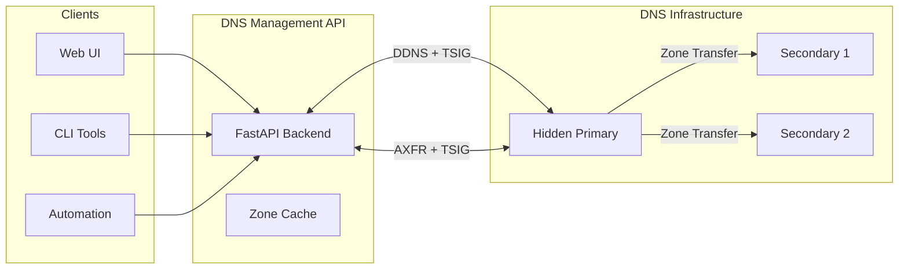

## Core Design Principle: DNS as the Source of Truth

**The DNS server is the authoritative source of all zone and record data.** This is a deliberate architectural decision with significant benefits.

### The Hidden Primary Pattern

In a typical production DNS deployment, the architecture looks like this:

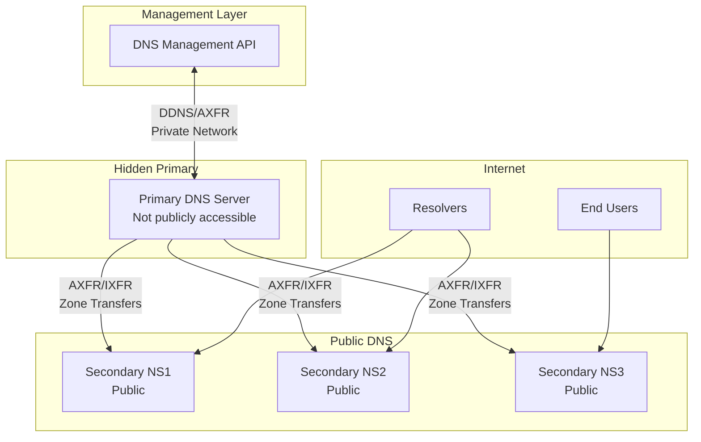

The **hidden primary** is a DNS server that:
- Is not listed in NS records
- Is not publicly accessible
- Receives all updates via DDNS
- Propagates changes to public secondaries via zone transfer

This API is designed to work with this pattern. It sends updates to the hidden primary, which then propagates to the public-facing servers.

### What This Means in Practice

1. **No separate database** — Zone data is stored only in DNS
2. **No synchronization problems** — There's nothing to sync
3. **Standard DNS replication** — Changes propagate via normal zone transfers
4. **Any DNS client works** — The data is accessible via standard DNS queries

## Why Not a Database?

Many DNS management systems take a different approach: storing zone data in a database, then generating zone files or pushing updates to DNS servers. This can create significant problems.

### The Dual Source of Truth Problem

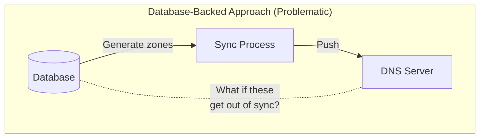

When you have a database AND DNS servers containing zone data:

| Problem | Description |
|---------|-------------|
| **Sync failures** | Network issues, crashes, or bugs can cause database and DNS to diverge |
| **Split-brain** | Which source is correct when they disagree? |
| **Manual changes** | Direct DNS edits bypass the database entirely |
| **Complexity** | Need sync jobs, reconciliation, conflict resolution |
| **Latency** | Changes must propagate through multiple systems |

### The DNS-Native Approach (This System)

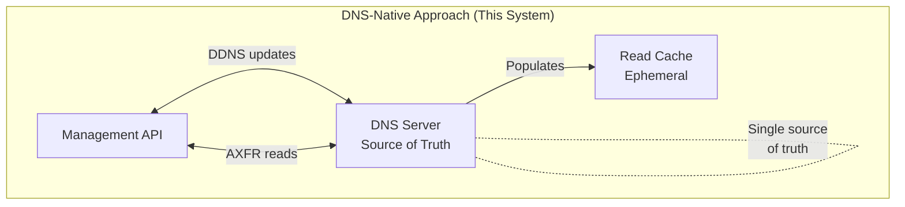

Benefits of treating DNS as the source of truth:

| Benefit | Description |
|---------|-------------|
| **Single source of truth** | DNS server is always authoritative |
| **No sync needed** | The API reads from and writes to the same place |
| **Atomic updates** | DDNS updates are processed atomically by the DNS server |
| **Standard protocols** | Works with any RFC-compliant DNS server |
| **Operational simplicity** | No database to manage, back up, or scale for *zone state* |
| **Direct queries work** | `dig` and other tools see the same data as the API |

### Intent Versus State: Scheduled Changes

Zone **state** (what records exist now) still lives only in DNS. Named, time-scheduled changes are **intent** (what to do later) — they have no representation in a zone until they execute. For that reason the scheduler persists intent in a database:

| Stored in the database | Still only in DNS |
|------------------------|-------------------|
| Change name, schedule, expiry | Current RRsets |
| Operations and prerequisites | Serial / SOA |
| Audit trail of apply/fail | Authoritative answers |

The database is never used as a dual source of truth for zone contents. After a change applies, the authoritative result is whatever the DNS server accepted via DDNS; the cache is refreshed from DNS as usual.

Applied changes can later be **reverted** if a pre-apply snapshot was captured. At apply time the executor records prior RRset state (`prior_ttl` / `prior_records` / `snapshot_at`) for each operation. Revert builds inverse ADD/DELETE operations and sends them immediately; status becomes terminal `reverted`. Changes applied before snapshot support (missing `snapshot_at`) cannot be reverted.

### Storage Backends

The store runs on either SQLite or PostgreSQL, selected by `database.backend`. This is the only persistent state in the system, so the choice is about how durable and how shared that state needs to be — not about zone data.

```
config.database ──> scheduler/engine.py ──> AsyncEngine ──┬──> sqlite+aiosqlite
                                                          └──> postgresql+psycopg
                            │
scheduler/schema.py  (one MetaData definition, both dialects)
                            │
scheduler/migrations/ (Alembic) ──> alembic upgrade head at startup
                            │
scheduler/store.py   (SQLAlchemy Core expressions, no dialect-specific SQL)
```

One schema definition in `scheduler/schema.py` drives both backends. Where the dialects genuinely differ, the type layer absorbs it:

| Concept | PostgreSQL | SQLite |
|---------|-----------|--------|
| Timestamps | `timestamptz` | ISO-8601 UTC text, which sorts chronologically |
| JSON columns | `jsonb` | Serialised text |
| Event surrogate key | `bigserial` | `INTEGER` rowid alias |
| Booleans | `boolean` | `0` / `1` |

The one place the store adapts its SQL is claiming due changes. On PostgreSQL the candidate row is selected `FOR UPDATE SKIP LOCKED`, so several application instances can poll one database without either blocking each other or double-claiming a change. SQLite databases are not shared, so the clause is omitted.

Schema creation and upgrades are handled by Alembic, packaged inside the distribution so migrations ship with the image. At startup the application runs `alembic upgrade head`, which means pointing it at an empty database is enough to get a working schema. On PostgreSQL the upgrade is wrapped in an advisory lock (`pg_advisory_lock`) so instances starting simultaneously serialise their DDL instead of racing. Set `database.auto_migrate: false` to apply migrations out of band instead; startup then fails with a clear error if the schema is absent.

Within a process, transactions are serialised by a re-entrant lock and owned by the outermost store method. Store methods therefore compose (`create()` calls `get()`) while each remaining atomic: a method that fails partway through leaves nothing behind.

### The Cache is Not a Source of Truth

This system maintains an in-memory cache of zone data for performance. This cache is:

- **Ephemeral** — Lost on restart, rebuilt from DNS
- **Read-only copy** — Never authoritative
- **Automatically refreshed** — Based on SOA refresh timers and notify messages.
- **Invalidated on writes** — Updated optimistically, refreshed if inconsistent

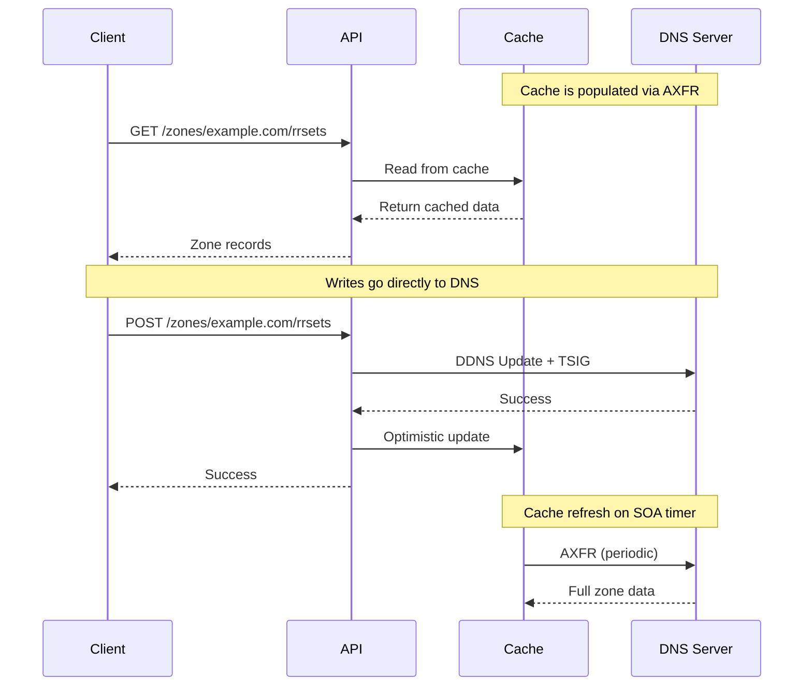

## System Components

### Backend (FastAPI)

The Python backend provides:

- **REST API** — CRUD operations for DNS records
- **DDNS Client** — Sends RFC 2136 updates with TSIG authentication
- **Zone Cache** — In-memory cache populated via AXFR
- **Catalog Zone Support** — Auto-discovery of zones via RFC 9432
- **Webhook Dispatcher** — Notifies Slack, Teams, or JSON endpoints when a change is committed

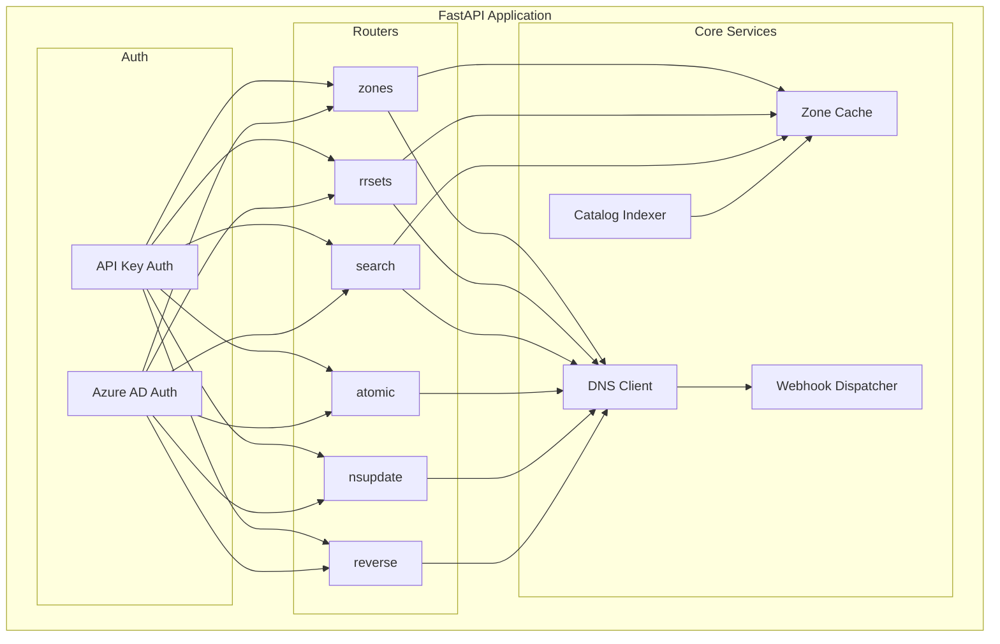

### Frontend (TypeScript/Alpine.js)

A standalone single-page application that:

- Communicates with the backend via REST API
- Provides zone browsing and record management
- Supports search across all zones
- Handles authentication (API key or Azure AD)

### DNS Server (BIND or compatible)

Any DNS server supporting:

- AXFR zone transfers (RFC 5936)
- DDNS updates (RFC 2136)
- TSIG authentication (RFC 2845)
- Optionally: Catalog zones (RFC 9432)

## Data Flow

### Reading Zone Data

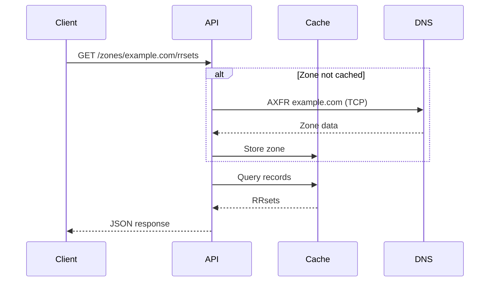

### Writing Records

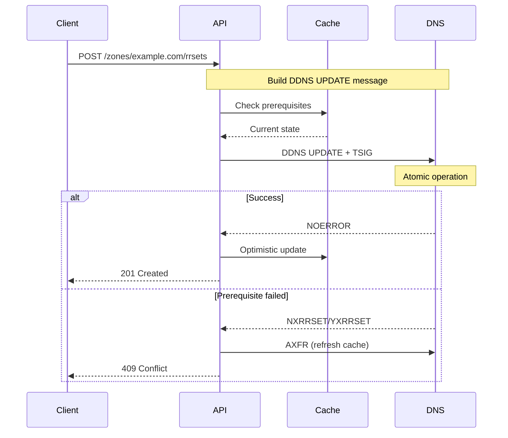

### Atomic Multi-Operation Updates

Multiple operations can be combined into a single DNS transaction:

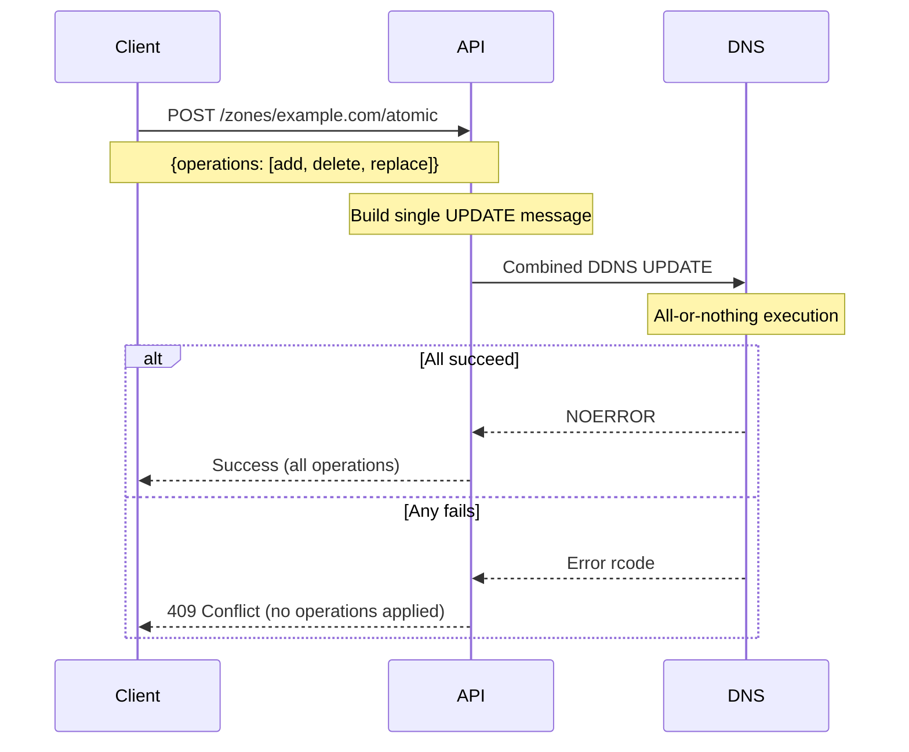

The same builder is used for **scheduled changes** (`POST /v1/scheduled-changes`). A named change can be applied immediately or when a background scheduler claims it after `scheduled_at`. Explicit DNS prerequisites (NXDOMAIN / YXDOMAIN / NXRRSET / YXRRSET) and auto-derived prerequisites are attached to the same UPDATE message so the check and write stay atomic.

Statuses include `draft`, `scheduled`, `running`, `applied`, `failed`, `cancelled`, `expired`, and `reverted`. `POST /v1/scheduled-changes/{id}/revert` undoes an `applied` change using snapshots taken at apply time; `GET .../revert-preview` shows the inverse operations and a warning that only that change is undone.

### Change Notifications

Every DNS write in the system funnels through one method, `DNSClient._send_update()`, which is where notifications are emitted. Hooking the single commit point rather than each of the eight API write paths means a new endpoint cannot silently skip notifying, and no path can notify twice.

That one hook does not know *who* asked for the write, because `_send_update()` only receives a DNS message. Attribution travels out of band in a `ContextVar`: the authentication dependency records the caller for API requests, and the scheduler executor records the change it is applying. Since every request handler and every scheduler task runs in its own asyncio context, concurrent writes cannot read each other's attribution.

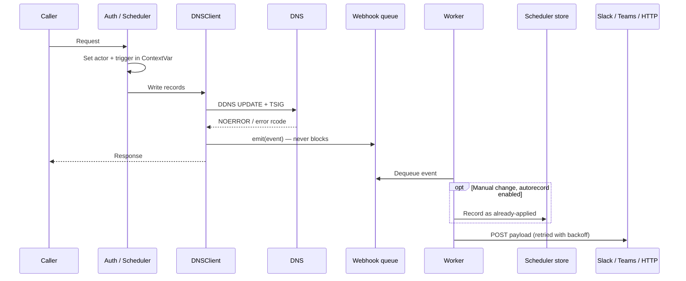

Delivery is deliberately decoupled: `emit()` only puts the event on a bounded in-memory queue, and a single background worker performs the SQLite write and HTTP requests. A slow, failing, or unreachable webhook endpoint therefore cannot delay a DNS write or turn a successful change into an API error. When the queue is full, events are dropped and counted rather than applying backpressure to DNS.

The notification's link is the part that needs the scheduler store. A scheduled change already has a record to point at, so its notification links to itself. A manual record edit has nothing, so the worker records it in the store as an already-applied change with `source = 'manual'`, which both gives the link a destination and makes manual changes browsable alongside scheduled ones. These records describe what was already committed to DNS, so they are history rather than intent — they carry no pre-apply snapshot and cannot be reverted. If that write fails, the notification falls back to linking to the zone rather than to a change that does not exist.

Operations are recovered from the DNS UPDATE message itself rather than passed down from the call sites, by reading each RRset's delete class (absent for adds, `NONE` for specific-record deletes, `ANY` for whole-RRset deletes). A `replace` arrives as a delete-`ANY` immediately followed by an add for the same name and type, and those pairs are coalesced back into a single `replace` so notifications describe the intent rather than the wire encoding.

## Consistency Model

### Prerequisites Ensure Consistency

DDNS updates include prerequisite conditions that must be met for the update to proceed:

| Operation | Prerequisite | Meaning |
|-----------|-------------|---------|
| Add | `NXRRSET` | RRset must not exist |
| Delete | `YXRRSET` | RRset must exist with expected values |
| Replace | `YXRRSET` | RRset must exist with expected values |

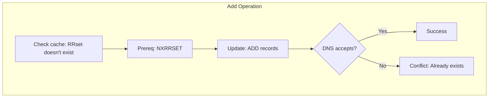

### Handling Concurrent Modifications

When the prerequisite fails, it means the DNS state has changed since the cache was last refreshed (possibly by another client or direct DNS edit):

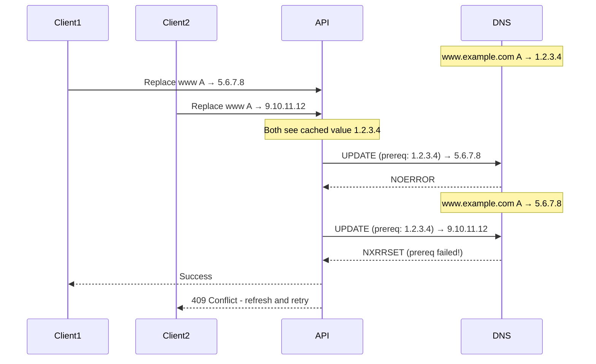

This optimistic concurrency control ensures no updates are lost due to race conditions.

## Deployment Topology

### Development Environment

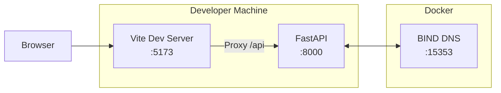

### Production Environment

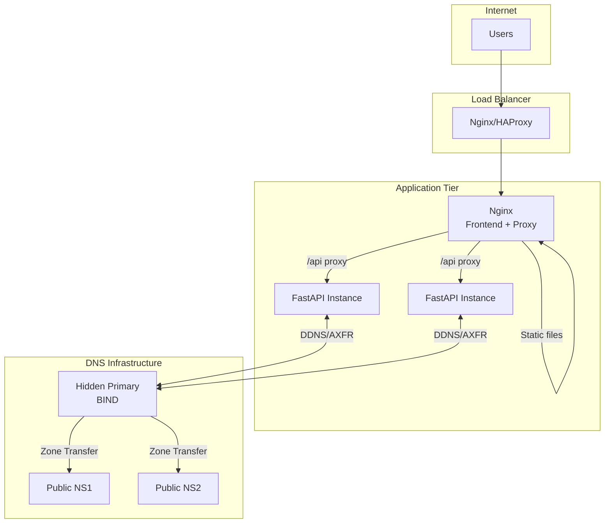

## Security Model

### Authentication Layers

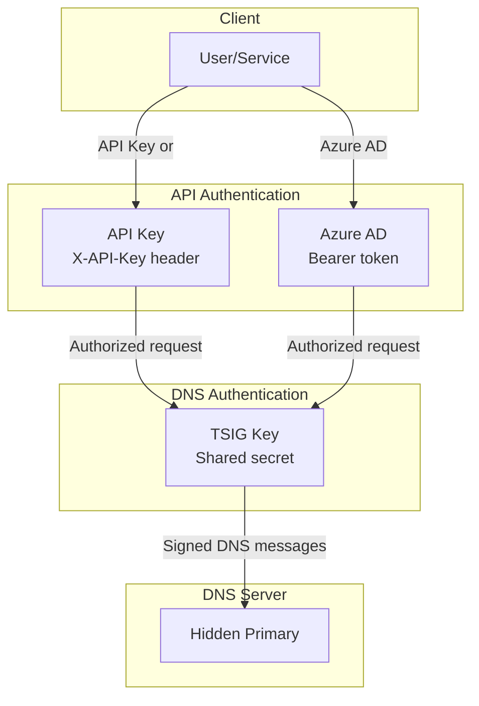

### TSIG Authentication

All DNS operations are authenticated using TSIG (Transaction SIGnature):

- Shared secret between API and DNS server
- HMAC signature on every DDNS update and AXFR request
- Configured via environment variables (key name, secret, algorithm)

### Network Security Recommendations

1. **Hidden primary should be on a private network** — Not accessible from the internet
2. **TLS termination at load balancer** — Encrypt client traffic. This system doesn't do TLS.

---

## Further Reading

- [RFC 2136 - Dynamic Updates in DNS](https://datatracker.ietf.org/doc/html/rfc2136)
- [RFC 2845 - Secret Key Transaction Authentication (TSIG)](https://datatracker.ietf.org/doc/html/rfc2845)
- [RFC 5936 - DNS Zone Transfer Protocol (AXFR)](https://datatracker.ietf.org/doc/html/rfc5936)
- [RFC 9432 - DNS Catalog Zones](https://datatracker.ietf.org/doc/html/rfc9432)
- [DEVELOPMENT.md](./DEVELOPMENT.md) - Development setup guide
- [README.md](./README.md) - Project overview and configuration

